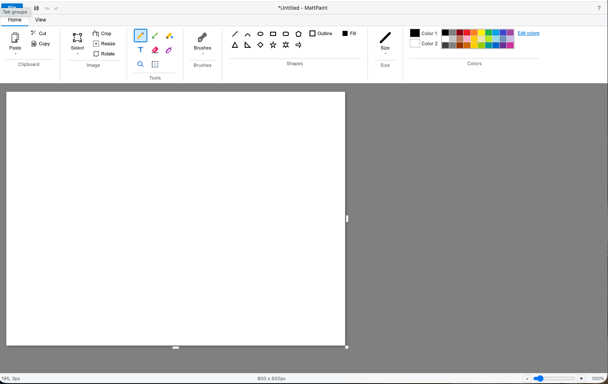

# MattPaint

A pixel-perfect recreation of **Microsoft Paint (Windows 10)** for the web and Mac. Built with pure vanilla JavaScript, HTML5 Canvas, and CSS - no dependencies required.

  



## Features

### Drawing Tools
- **Pencil** - Freehand drawing with pixel precision
- **Brush** - Multiple brush types including:
  - Standard brush
  - Calligraphy (2 angles)
  - Airbrush with spray effect
  - Oil brush
  - Crayon texture
  - Marker (semi-transparent)
  - Watercolor
- **Eraser** - Erase to background color
- **Fill (Paint Bucket)** - Flood fill with optimized algorithm
- **Color Picker (Eyedropper)** - Sample colors from canvas
- **Text Tool** - Full text support with font options, sizes, and styles (bold, italic, underline, strikethrough)

### Shapes
- Line, Curve, Rectangle, Oval, Rounded Rectangle
- Triangle, Right Triangle, Diamond, Polygon
- 5-point and 6-point Stars
- Arrows (all 4 directions)
- Heart, Lightning Bolt
- Configurable outline and fill styles

### Selection Tools
- Rectangular selection
- Free-form selection with lasso tool
- Move, copy, cut, paste selections
- Transparent selection mode
- Crop to selection

### Image Operations
- Rotate (90°, 180°, custom)
- Flip (horizontal/vertical)
- Resize with aspect ratio lock
- Skew transformation
- Zoom (up to 800%)

### File Operations
- New, Open, Save (PNG, JPEG, BMP, GIF)
- Print support
- Drag & drop image loading
- Set as desktop wallpaper

### UI Features
- Authentic Windows 10 ribbon interface
- Rulers with measurement markings
- Gridlines overlay
- Status bar with coordinates and zoom
- Full keyboard shortcuts
- Touch/stylus support

## Keyboard Shortcuts

| Action | Shortcut |
|--------|----------|
| Pencil | `P` |
| Brush | `B` |
| Eraser | `E` |
| Fill | `G` |
| Text | `T` |
| Select | `S` |
| Magnifier | `Z` |
| Line | `L` |
| Rectangle | `R` |
| Oval | `O` |
| Undo | `Cmd/Ctrl + Z` |
| Redo | `Cmd/Ctrl + Y` |
| Copy | `Cmd/Ctrl + C` |
| Paste | `Cmd/Ctrl + V` |
| Select All | `Cmd/Ctrl + A` |
| Save | `Cmd/Ctrl + S` |
| New | `Cmd/Ctrl + N` |
| Open | `Cmd/Ctrl + O` |
| Zoom In | `+` |
| Zoom Out | `-` |

## Getting Started

### Option 1: Just Open It
Simply open `index.html` in any modern browser. That's it!

### Option 2: Local Server
```bash
# Using Python
python3 -m http.server 8000

# Using Node.js
npx serve
```

Then visit `http://localhost:8000`

## Project Structure

```
MattPaint/
├── index.html          # Main HTML file
├── js/
│   └── app.js          # All application logic (~3200 lines)
├── css/
│   ├── paint.css       # Main styles
│   ├── ribbon.css      # Ribbon toolbar styles
│   └── dialogs.css     # Modal dialog styles
└── README.md
```

## Browser Support

- Chrome (recommended)
- Firefox
- Safari
- Edge

## Why MattPaint?

- **Zero Dependencies** - No npm, no build tools, no frameworks
- **Lightweight** - Under 100KB total
- **Offline Ready** - Works without internet
- **Faithful Recreation** - Looks and feels like real MS Paint
- **Educational** - Clean, readable vanilla JS code

## License

MIT License - feel free to use, modify, and distribute.

## Author

Created by **Matt Macosko** ([@nicedreamzapp](https://github.com/nicedreamzapp))

---

*"Sometimes you just need to paint."*
