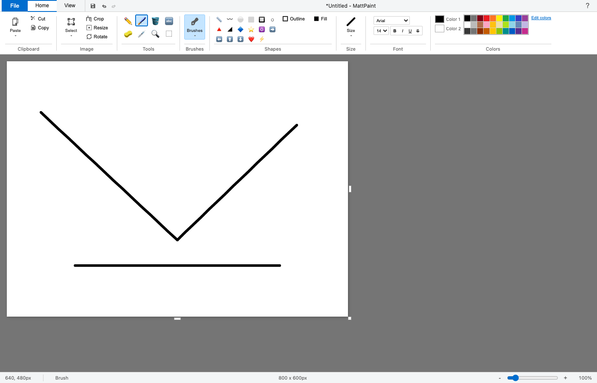
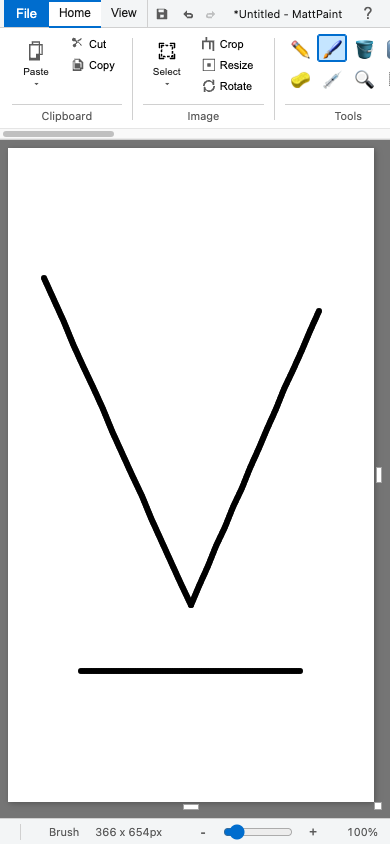
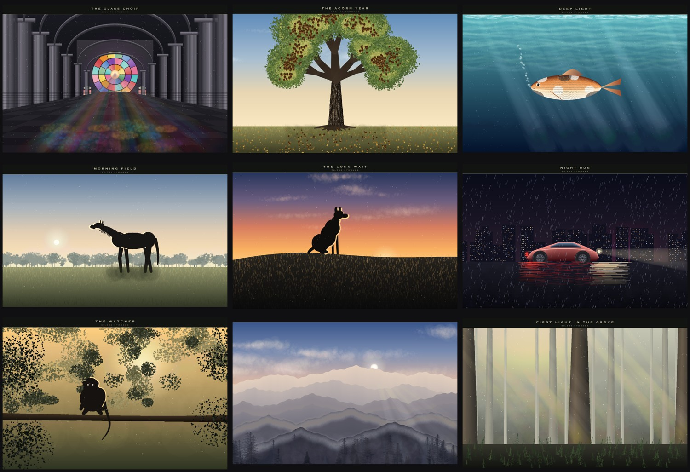

# MattPaint

A pixel-perfect recreation of **Microsoft Paint (Windows 10)** for the web. Built with pure vanilla JavaScript, HTML5 Canvas, and CSS - no dependencies, no build step. Works on desktop, tablet and phone.

**In one sentence:** MattPaint is Paint in your browser (or as a Mac and Windows app), with every classic tool, shape and brush, and it is live right now at the links below.

**[⬇️ Download for Mac](https://github.com/nicedreamzapp/MattPaint/releases/latest/download/MattPaint-mac.zip)**
(Apple Silicon and Intel, signed and notarized) &nbsp;·&nbsp;
**[⬇️ Download for Windows](https://github.com/nicedreamzapp/MattPaint/releases/latest/download/MattPaint-windows-setup.exe)**
(Windows 10 and 11)

**Or use it free in your browser, no download:** [nicedreamzwholesale.com/paint](https://nicedreamzwholesale.com/paint/) · [nicedreamzapp.github.io/MattPaint](https://nicedreamzapp.github.io/MattPaint/)

The desktop app is the same Paint in its own window, working offline, with a real Save window,
the system print dialog, and a Set as desktop background that actually sets it. It lives in
[`desktop/`](desktop/).

  





## 🛠️ What I built

Everything here was built by **Matt Macosko**:

- **The Paint app**: [`index.html`](index.html) (ribbon UI), [`js/app.js`](js/app.js) (every tool, shape, brush, selection, undo/redo, zoom and file operation) and [`css/`](css/) (including the phone layout).
- **The self-test suite**: [`test-in-app.js`](test-in-app.js), 65 checks that run inside the live page.
- **The desktop app**: [`desktop/`](desktop/). [`desktop.js`](desktop/desktop.js) turns the web version's download, print pop-up and wallpaper instructions into a real Save window, the system print dialog and an actual wallpaper change; [`src-tauri/src/main.rs`](desktop/src-tauri/src/main.rs) is the native side; [`build-mac.sh`](desktop/build-mac.sh) and [`.github/workflows/desktop-windows.yml`](.github/workflows/desktop-windows.yml) build the Mac and Windows downloads, and the Windows workflow runs [`selftest.js`](desktop/selftest.js) against the built app. The app shell is the upstream [Tauri](https://tauri.app) framework.
- **A painting-from-scratch experiment**: [`fast/`](fast/) drives MattPaint through the Chrome DevTools Protocol ([`fast/engine.py`](fast/engine.py)) and paints pictures stroke by stroke with no images going in. [`fast/scene_engine.py`](fast/scene_engine.py) holds the drawing knowledge, and [`fast/director.py`](fast/director.py) has a local open-weight vision model (upstream Gemma 4 or Qwen, run with upstream MLX) write a short recipe ([`fast/RECIPES.md`](fast/RECIPES.md)), look at the painting and revise it. Results, generation by generation, are in [`gallery/`](gallery/).



## Features

### Drawing Tools
- **Pencil** - Freehand drawing with pixel precision
- **Brush** - Multiple brush types including:
  - Standard brush
  - Calligraphy (2 angles)
  - Airbrush with spray effect
  - Oil brush
  - Crayon texture
  - Marker (semi-transparent)
  - Watercolor
- **Eraser** - Erase to background color
- **Fill (Paint Bucket)** - Flood fill with optimized algorithm
- **Color Picker (Eyedropper)** - Sample colors from canvas
- **Text Tool** - Full text support with font options, sizes, and styles (bold, italic, underline, strikethrough)

### Shapes
- Line, Curve, Rectangle, Oval, Rounded Rectangle
- Triangle, Right Triangle, Diamond, Polygon
- 5-point and 6-point Stars
- Arrows (all 4 directions)
- Heart, Lightning Bolt
- Configurable outline and fill styles

### Selection Tools
- Rectangular selection
- Free-form selection with lasso tool
- Move, copy, cut, paste selections
- Transparent selection mode
- Crop to selection

### Image Operations
- Rotate (90° left or right, 180°)
- Flip (horizontal/vertical)
- Resize with aspect ratio lock
- Skew transformation
- Zoom (up to 800%)

### File Operations
- New, Open, Save (PNG, JPEG, WebP, BMP)
- Print support
- Drag & drop image loading
- Set as desktop wallpaper

### UI Features
- Authentic Windows 10 ribbon interface
- Rulers with measurement markings
- Gridlines overlay
- Status bar with coordinates and zoom
- Full keyboard shortcuts
- Touch/stylus support

## Keyboard Shortcuts

| Action | Shortcut |
|--------|----------|
| Pencil | `P` |
| Brush | `B` |
| Eraser | `E` |
| Fill | `G` |
| Text | `T` |
| Color Picker | `I` |
| Select | `S` |
| Magnifier | `Z` |
| Line | `L` |
| Rectangle | `R` |
| Oval | `O` |
| Undo | `Cmd/Ctrl + Z` |
| Redo | `Cmd/Ctrl + Y` |
| Cut | `Cmd/Ctrl + X` |
| Copy | `Cmd/Ctrl + C` |
| Paste | `Cmd/Ctrl + V` |
| Select All | `Cmd/Ctrl + A` |
| Save | `Cmd/Ctrl + S` |
| New | `Cmd/Ctrl + N` |
| Open | `Cmd/Ctrl + O` |
| Print | `Cmd/Ctrl + P` |
| Zoom In | `+` |
| Zoom Out | `-` |

## Getting Started

### Option 1: Use it online
Open [nicedreamzwholesale.com/paint](https://nicedreamzwholesale.com/paint/) on anything with a browser. On a phone the canvas sizes itself to the screen and the ribbon scrolls sideways.

### Option 2: Just Open It
Clone the repo and open `index.html` in any modern browser. That's it!

### Option 3: Local Server
```bash
# Using Python
python3 -m http.server 8000

# Using Node.js
npx serve
```

Then visit `http://localhost:8000`

## Project Structure

```
MattPaint/
├── index.html          # Main HTML file
├── js/
│   └── app.js          # All application logic (~3800 lines)
├── css/
│   ├── paint.css       # Main styles + phone layout
│   ├── ribbon.css      # Ribbon toolbar styles
│   └── dialogs.css     # Modal dialog styles
├── test-in-app.js      # In-browser self-test suite
├── TESTING-CHECKLIST.md
├── desktop/            # Mac and Windows app (Tauri)
├── fast/               # Painting-from-scratch experiment (Python)
└── gallery/            # Paintings made by fast/
```

## Tests

Add `?test` to the URL (for example `index.html?test`) and the built-in suite runs 65 checks against the live DOM and reports in the corner of the page. It is not loaded otherwise.

## Browser Support

- Chrome / Edge
- Firefox
- Safari, including iPhone and iPad (touch drawing)
- Android Chrome

## Why MattPaint?

- **Zero Dependencies** - The web version needs no npm, no build tools, no frameworks (only the desktop build uses npm and Tauri)
- **Lightweight** - About 230KB of HTML, JS and CSS, unminified
- **Offline Ready** - Works without internet
- **Faithful Recreation** - Looks and feels like real MS Paint
- **Educational** - Clean, readable vanilla JS code

## Known limits

- **BMP save**: browsers can't encode BMP from a canvas, so most will give you a PNG with a `.bmp` name. Pick PNG, JPEG or WebP for a real file.
- **Web version**: Save downloads the file, Print opens a pop-up, and Set as desktop background downloads the picture and tells you how to set it yourself. The desktop app does all three for real.
- **Desktop app**: Mac and Windows only, no Linux build. `desktop/build-mac.sh` needs an Apple Developer ID certificate and notary key to produce the signed download.
- **`fast/`** is a personal experiment tied to Matt's Mac: it expects Brave at its Mac path, a local MLX model server and local model files, and `run_director.sh` coordinates with other local services. It is not set up to run on another machine.

## License

MIT License - feel free to use, modify, and distribute.

## Author

Created by **Matt Macosko** ([@nicedreamzapp](https://github.com/nicedreamzapp))

---

*"Sometimes you just need to paint."*
